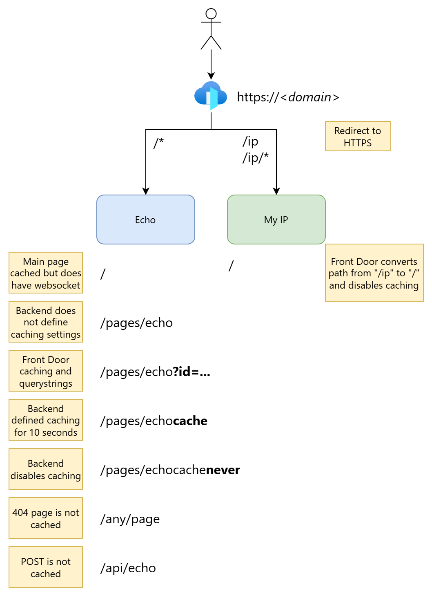

# Azure Front Door

[Configure rule sets in Azure Front Door](https://learn.microsoft.com/en-us/azure/frontdoor/standard-premium/how-to-configure-rule-set)

[Cache purging in Azure Front Door with Azure PowerShell](https://learn.microsoft.com/en-us/azure/frontdoor/standard-premium/how-to-cache-purge-powershell)

## Setup

### Demo



### Deploy

```powershell
$result = .\deploy.ps1 -BackendAddress1 "app1.contoso.com" -BackendAddress2 "app2.contoso.com"
$result
$result.outputs.fqdn.value

$domain = $result.outputs.fqdn.value
```

How many 
[POPs](https://learn.microsoft.com/en-us/azure/frontdoor/edge-locations-by-region)
have been used:

```sql
AzureDiagnostics
| where Category == "FrontDoorAccessLog"
| summarize Count=count(pop_s) by pop_s
```

```sql
AzureDiagnostics
| where Category == "FrontDoorWebApplicationFirewallLog" and action_s != "Log"
| take 500
```

### Test

Check `X-Cache` header if it is `TCP_HIT` or `TCP_MISS` or `TCP_REMOTE_HIT`
([Response headers](https://learn.microsoft.com/en-us/azure/frontdoor/front-door-caching?pivots=front-door-standard-premium#response-headers)):

```powershell
start "http://$domain"

curl "http://$domain/" --verbose # Redirect to HTTPS

curl "https://$domain/"

curl -sIXGET "https://$domain/"
curl -sIXGET "https://$domain/ip"
curl "https://$domain/ip"
curl -sIXGET "https://$domain/pages/echo"
curl -sIXGET "https://$domain/pages/echocache" # 10 seconds cache
curl -sIXGET "https://$domain/pages/echocachenever" # Never cached
curl -sIXGET "https://$domain/some/page/that/does/not/exist"

# Never cached since using "queryStringCachingBehavior: 'UseQueryString'":
curl -sIXGET "https://$domain/pages/echo?id=$([Guid]::NewGuid().Guid)"

# Use APIs:
$url = "https://$domain/api/echo"
$data = @{
    firstName = "John"
    lastName = "Doe"
}
$body = ConvertTo-Json $data
Invoke-RestMethod -Body $body -ContentType "application/json" -Method "POST" -DisableKeepAlive -Uri $url

curl -d '{ "data": "Hello there!" }' -H "Content-Type: application/json" -X POST "https://$domain/api/echo"

# This request will be blocked by the WAF:
curl -d '{ "data": "alert(document.cookie)" }' -H "Content-Type: application/json" -X POST "https://$domain/api/echo"
curl -d '{ "data": "--; DROP TABLE People" }' -H "Content-Type: application/json" -X POST "https://$domain/api/echo"
```

```bash
ab -n 1000 -c 25 https://$domain/
```

### Clean up

```powershell
Remove-AzResourceGroup -Name "rg-afd-basic" -Force
```
